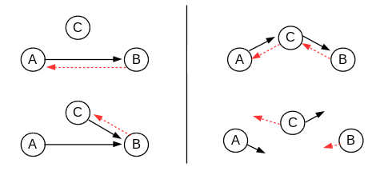
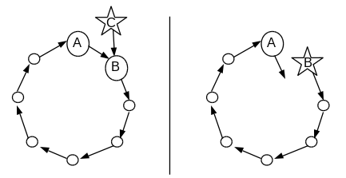
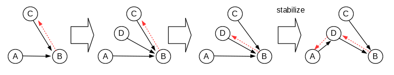
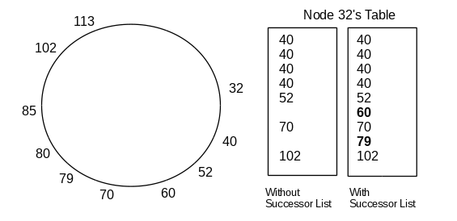
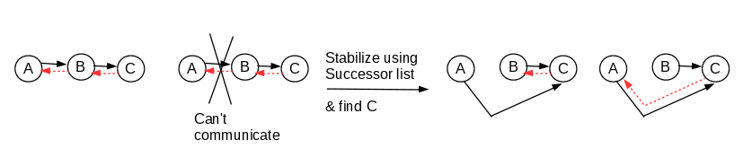
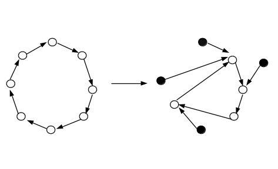

#Streaming on Chord DHT

##1. ABSTRACT

coming

##2. INTRODUCTION

A significant number of distributed hash table (DHT) models have been designed with intent to be used in peer-to-peer (P2P) applications. These prototypes include CAN, Chord, Pastry, Kademlia and more. P2P is a general term for any networked environment where every node is responsible both as a client and a server. DHT provides a popular infrastructure for P2P as it locates data without a server. It also scales the network up, distributes content evenly and routes among the nodes fast. Among those prototypes, we chose the Chord DHT because it has a simple design and has been frequently studied and mentioned by researchers. 

This project has addressed the motivated problem of maintaining the Chord ring overlay structure along with node and communication faults. Regarding this concern, studies have discovered and improved possible incorrectness in Chord-like DHTs. 

Our interest is in approaching this known problem at the application level.  After building a DHT P2P system, we have performed media streaming atop the system. This involves querying  serialized messages and data chunks. This practical approach has led us to detect and handle the incorrectness at a higher level than the DHT. **As a result, … (Pls give one sentence on 'our' streaming)**

##3. DESIGN

The following functionalities are based on settings and assumptions documented in the firstly presented Chord paper [Stoica], unless specified otherwise.

###3.1 Scalability

Each node participates the network via links to its adjacent nodes. This relation forms P2P overlays. When a node is added or removed, the adjacency state is coordinated locally. That is, a node only knows the keys to nodes that this node is responsible for. In this context, a removed node's keys should be passed to a neighbor node; a new node should own some keys. DHTs make these possible by reassigning local hash tables in the way distributing the responsibilities.

###3.2 Balanced Key Space

Chord takes and extends the idea of consistent hashing that reduces number of keys to reassign when a distributed system is resized. The reduction is achieved when each participating node only “views” its “roughly equal share”. [Karger]  As traditional hashing, nodes are identified by keys randomized by a hash function.  The keys are then assigned to the node whose key “most immediately follows it” [Freedman]. While doing so, but in consistent hashing, the last node is glued to the first one. This gives illusion that the key space is now circular, moving in clockwise direction.  In this way a node on average holds O(K/n) keys, where K = number of keys, n = number of nodes. When this node leaves the system, the number of reassigned keys is only as large as the size of the local hash table. 

###3.3 Routing Performance

Above is still true in Chord, with table-size log n.  The number of bits in a key is defined as the same value log(n). Using SHA1 hash function, a key is 160-bit long and a hash table becomes 160-keys long as well.  This means the DHT-based system now partitions the key space so that each node knows 160 possible nodes to reach. Each hash table can be considered as a routing table storing key-address pairs (i.e. fingers).  The Chord DHT has every i-th key of the first node that succeeds or equals (n + 2i).  The i-th entry then points the node in distance of (1 / 2n-i). When querying a target node, a node recursively hops to the node of the largest key that is smaller than that of the target. This ensures routing delay within O(log n). This greedy algorithm sets bound for required bandwidth which seems to work practically with large n. This is an enhancement from consistent hashing which possibly “requires computing all” the keys. [Karger] 

###3.4 Node subscription and exit/failure

To add or remove a node, two tasks should get done: updating all the routing tables that involve the node; and, transferring key responsibility from/to its new successor.  These operations are known to cost time complexity O(log n)^2.  Assume node B is node A's successor. To add C,  the system updates the predecessor A's routing table according to C, and recursively do the same through the routing tables of all other nodes that have entries of B. C gains the responsibility for keys in the range of (a, c] which was previously part of B's key (a, b]. Now B is only responsible for keys in (c, b]. (Figure 1) Similarly, when C leaves or gets detected to be failed,  all keys stored in C's routing table become reassigned to it's successor B.  All  associated routing table removes C. The successor B now owns C's keys as well as its previous keys. (Figure 2)

> Figure 1 (left).   Key transfer with new node.

> Figure 2 (right).    Key transfer with removed node.

It is important to keep track of nodes' state so that the Chord system keeps invariants true for data consistency. That is, “all members agree about which members store values for which keys”. [Zave] This topic is beyond the scope of this report. Rather, we narrow our focus down into how a node can reach its adjacent overlay peers correctly. A node's reachability is a necessary prerequisite to its data consistency. 

 
##4. CHORD RING MAINTENANCE

Every participating node is a member of a ring. The node has links to a successor node (whose key is next highest) and a predecessor (whose key is closest past). The successor is also defined as the smallest key entry stored in each routing table. Chord ring topology is defined by the successor pointer. To maintain this topology, the system is required to have exactly one ring and all members in the ring in right order. [Zave]

###4.1 Member changes

Before any addition or removal of nodes proceeds, the ring's member relation is redefined. When the previous example of adding a node is about to occur, node C first asks the predecessor A for A's current successor key. The returning key is of node B, which  becomes C's  successor; and C becomes B's predecessor (represented as dashed line in Figure 3).   Until A notices that B now points to a different predecessor than itself, B has two members believing that they are the successor. 

> Figure 3 (left).   Adding node C to the ring structure.

> Figure 4 (right).   Removing node C from the ring structure.

As seen in Figure 5, the ring seems maintain with an appendage cause by C. However it does not circulate properly because A's idea of its successor B and B's idea of its predecessor C do not agree. To resolve this the Chord paper suggests a periodic heartbeat feature (i.e., stabilization) to detect an incorrect successor-relation. 

> Figure 5 (left). A global view of  Figure 3.

> Figure 6 (right). A global view of Figure 4.

###4.2 Stabilization protocol

Every member pings the node whose key is locally stored as its processor and ask for its predecessor. In case the returned predecessor key does not agree with itself, the node redirect its successor pointer to the returned predecessor. Then the new predecessor will set its predecessor pointer to this node and the ring is repaired. For example, node A in Figure 5 asks node B for what B's predecessor is and B returns node C.  Since B's predecessor is not A itself, A adopts B's predecessor C as new successor. For A, C is a rational choice for its successor because C clearly has larger key than A's – otherwise C could not have been A's former successor B's predecessor – and smaller than B's because B is C's successor.  Thus after C sets A as its predecessor successfully, it continues to update routing tables and key responsibilities as appropriate. Since the paper does not provide much more details, the member is set to send two arbitrary messages expecting one back, as described on the page 3 of the proposal.

An obvious weakness of this method, also mentioned in the Chord paper, is that it cannot handle concurrent joins. If more than two nodes C, D join between two members A, B (Figure 7) before the periodic heartbeat incorporates at least one node into the ring, B eventually sets its predecessor pointer to the later added D. Once A has been stabilized, it recognizes D as its successor and transfers proper key responsibility to D. C becomes not reachable from other members. Although this does not violate P. Zave's conditions for a “valid” overlay structure (i.e., exactly one ring and ordered), it is incorrect in terms of key responsibility. After the stabilization B becomes responsible for keys (D, B]. Thus a key between (D, C) will belong to B. However C is a live node that deserves to own the key in the range. 

> Figure 7. Concurrent joins causing node C unreachable.

Also, this stabilization method does not help the system make progress when there is a 'hole in the network' after a node left (Figures 4 and 6). Since node A's successor is node C which does not exist  in the network, A gets no response to its ping. 

###4.3 Successor list

A solution to this missing node problem, according to the Chord paper, is that each member stores a replication of upcoming successors' keys as part of the routing table. In the example in Figure 8, the current successor of node 32 is node 40. If node 40 and 52 have failed at the moment of stabilization, the successor list with replication factor 5 (the second table) can find the next live successor node 60. These nodes, whose keys are stored for the purpose of finding an alternate successor, are called 'short links' – whereas 'long links' refers to the nodes whose keys are stored for routing efficiency. [Freedman]

> Figure 8. Successor list preserved for a local successor search.

###4.4 Correctness hazards

The stabilization protocol and the successor list together resolve most of member changes in the ring. But success is not guaranteed, as studies have articulated a number of scenarios causing incorrectness around Chord ring structure. Here is an example, a situation combining two basic cases shown in Figures 3 and 4. [Glendenning] The difference is that now node B leaves or fails, as soon as node D sets its successor to node C and C agrees with it. Node A uses the stabilization functionality to learn that its successor has been missing.  A then chooses its new live successor C in its routing table, since A does not know about D. This results in C gaining keys in range (A, C] and D becoming unreachable. Such incidence of unreachable nodes occurs frequently especially when we take communication faults into account. [Freedman] (Figure 10)

> Figure 9. Causing incorrect network while using stabilization and the successor list.

> Figure 10. Causing incorrect network due to a communication fault. 

A Chord ring overlay can easily increase the number of unreachable (but still live) nodes in the DHT system. Assuming equal amount of nodes have left and added, and all the rest of nodes are live, an initially 'ideal' ring will most likely result in a less effective shape as in Figure 11. [Zave]  With this assumption, we have attempted to implement an application layer on top of this DHT and run a series of on-going tasks such as media streaming.

> Figure 11. Ideal ring becoming an incorrect-but-still-valid ring.

##IMPLEMENTATION

* I think it should be about how we integrate media streaming code into Chord DHT and BRBR... which I can't write about. (mimi)

* `This section should not be very long. We do not want to see your class diagrams, code snippets, etc. The point of this section is to tell us in brief notable aspects of the implementation. For example, if you have a front-end, then this is the place to say that it is written in 10K lines of JavaScript, uses WebGL for rendering robot movement, has 0 tests, and yet still seems to work. Describe libraries that you've built on, operating system dependencies, and other important details that are implementation-specific. But, please be selective.`

##EVALUATION

* the results from the streaming? (mimi)

* `How do you know that your system does what you want it to? How did you test your system? Under what scenarios/workload did it work and for how long? This is also the section where you should explain how you integrated ShiViz into your prototype -- what are events in your system, what messages are instrumented with ShiViz?`

* `If you have graphs/tables with performance information, or other measurements that you've performed on your system, then add them here. Note that all empirical evaluation results must have a proper methodology to introduce the results. What was the goal of the evaluation: why did you measure what you measured? How many nodes were in the experiment, how were they connected, did you crash a node 1min into the experiment? Typically, the more information you provide to describe the experiments, the better. But, it requires careful judgment to report just the important details.`

##LIMITATIONS

* `Every system design is predicated on reasoning about and introducing trade-offs. You can't have it all when you build complex systems (e.g., CAP theorem is a concise example of this). In this section you should explain the limitations of your system and where your system does not work (because you have tested it and it failed to work), or may not work (a hypothesis drawn from design, but that you did not test). Every design has trade-offs. Don't worry about this section being long. Focus on limitations that are fundamental, rather than incidental (e.g., doesn't work on windows because we depend on bash is an incidental limitation).`

##DISCUSSION
* `Take a step back. What worked and didn't work during the project? Tell us an interesting story about your experience in building the system. Talk about the issues and challenges that came up during the project.`

##REFERENCES

[Stoica] I. Stoica, R. Morris, D. Karger, M. F. Kaashoek, and H. Balakrishnan. Chord: A Scalable Peer-to-peer Lookup Service for Internet Applications. In Proc. of SIGCOMM. ACM, 2001.

[Karger] D. Karger, E. Lehman, T. Leighton, Matthew Lewvine, D. Lewin, and R. Panigrahy.  Consistent Hashing and Random Trees: Distributed Caching Protocols for Relieving Hot Spots on the World Wide Web. In Proc. of the 29th Annual ACM Symposium on Theory of Computing, 1997.

[Freedman] M. J. Freedman, K. Lakshminarayana, S. Rhea, and I. Stoica. Non-Transitive Connectivity and DHTs. In Proc. of WORLDS, 2005

[Zave] P. Zave.  Using lightweight modeling to understand chord. ACM CCR, 2012.

[Glendenning] L. Glendenning, I. Beschastnikh, A. Krishnamurthy, and T. Anderson. Scalable Consistency in Scatter. In Proc. of the 23rd ACM Symposium on Operating Systems Principles. ACM, 2011.
