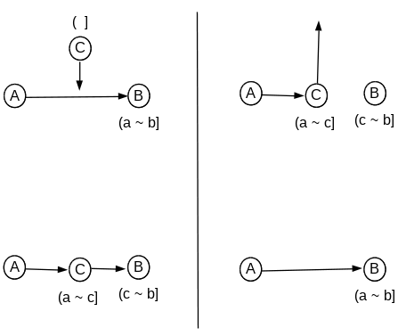

#Streaming on Chord

###INTRODUCTION

A significant number of distributed hash table (DHT) models have been developed taking peer-to-peer (P2P) applications explicitly into account. These prototypes include CAN, Chord, Pastry, Kademlia and more. P2P is a general term for any networked environment where every node is responsible both as a client and a server. DHT provides a popular infrastructure for P2P as it locates data without a server. It also scales the network up, distributes content evenly and routes among the nodes fast. Among those prototypes, we chose the Chord DHT because it has a simple design and has been frequently studied and mentioned by researchers. 

This project addressed the motivated problem of maintaining the Chord ring structure at node and communication failures. Regarding this concern, studies have discovered and improved possible incorrectness cases in traditional DHT designs including Chord.

Our interest is in approaching this known problem at the application level.  After building the DHT P2P overlay network, we have performed media streaming atop the system. This involves querying  serialized messages and data chunks. The results demonstrate two fold. First, it is a practical method to test the system.  [ should elaborate – one sentence ] Second, it may open possibility to detect and oversee the overlay topology, as a number of researchers suggested.

###DESIGN

**Scalability:** Each node participates the network via links to its adjacent nodes. This relation forms P2P overlays. When a node is added or removed, the adjacency state is coordinated locally. That is, a node only knows the keys to nodes that this node is responsible for. In this context, a removed node's keys should be passed to a neighbor node; a new node should own some keys. DHTs make these possible by reassigning local hash tables in the way distributing the reponsibilities.

**Balanced Key Space:** Chord takes and extends the idea of consistent hashing that reduces number of keys to reassign when a distributed system is resized. The reduction is achieved when each participating node only “views” its “roughly equal share”. [Karger]  As traditional hashing, nodes are identified by keys randomized by a hash function.  The keys are then assigned to the node whose key “most immediately follows it” [Freedman]. While doing so, but in consistent hashing, the last node is glued to the first one. This gives illusion that the key space is now circular, moving in clockwise direction.  In this way a node on average holds O(K/n) keys, where K = number of keys, n = number of nodes. When this node leaves the system, the number of reassigned keys is only as large as the size of the local hash table. 

**Routing Performance:** Above is still true in Chord, with table-size log(n).  The number of bits in a key is defined as the same value log(n). Using SHA1 hash function, a key is 160-bit long and a hash table becomes 160-keys long as well.  This means the DHT-based system now partitions the key space so that each node knows 160 possible nodes to reach. Each hash table can be considered as a routing table storing key-address pairs (i.e. fingers).  The Chord DHT has every i-th key of the first node that succeeds or equals (n + 2i).  The i-th entry then points the node in distance of (1 / 2n-i ). When querying a target node, a node recursively hops to the node of the largest key that is smaller than that of the target. This ensures routing delay within O(log(n)). This greedy algorithm sets bound for required bandwidth which seems to work practically with large n. This is an enhancement from consistent hashing which possibly “requires computing all” the keys. [Karger] 

Above functionalities are based on settings and assumptions documented in the firstly presented Chord paper [Stoica]. 

###CHORD RING MANAGEMENT

Every participating node is a member of a ring. The node has links to a successor node (whose key is next highest) and a predecessor (whose key is past lowest). Chord Ring topology is defined by the successor pointer, which is the smallest key entry stored in each routing table. 

**Changing the ring:**  To add or remove a member, two tasks should get done: updating all the routing tables that involve the member; and, transferring key responsibility from/to its new successor. Assume node B is node A's successor.

> Figure 1 (Left).   Node subscription followed by key transfer.
> Figure 2 (Right).    Node exit/detected failures followed by key transfer.

To join, C first asks the predecessor A for its old successor key. This returns C's new successor pointer. The system then updates predecessor A's routing table according to C, and recursively do the same through the routing tables of all other nodes that have entries of B. C gains the responsibility/ownership for keys in the range of (a, c] which was previously part of B's key (a, b]. Now B is only responsible for keys in (c, b]. (Figure 1) Similarly, when C leaves or gets detected to be failed,  all keys stored in C's routing table become reassigned to it's successor B.  All  associated routing table removes C. The successor B is now in charge of C's keys as well as its previous keys. (Figure 2)

It is important to keep track of nodes correctly so that the Chord system keeps invariants true for key and data consistency. That is, “all members agree about which members store values for which keys.” [Zave]

**Successor-list:** overall idea is from the paper. Replication
In the proposal, 

**Stabilizer:** overall idea is from the paper. 
In proposal, described as periodic “heartbeat”  : need super details about the algorithm

###RELATED WORK

There are studies that have interpreted above assumptions differently, or have articulated scenarios when they can get broken. 

----------------------------------------------------------------
Hey I am working on it right now & aim for writing UPTO this point. (including the abstract)  -- mimi
----------------------------------------------------------------

###IMPLEMENTATION

For this, I think it should be about how we integrate media streaming code into Chord DHT and BRBR... which I can't write about.

###EVALUATION

Same, it should be about the results from the streaming. 

###REFERENCES

[Karger] D. Karger, E. Lehman, T. Leighton, Matthew Lewvine, D. Lewin, and R. Panigrahy.  Consistent Hashing and Random Trees: Distributed Caching Protocols for Relieving Hot Spots on the World Wide Web. In Proc. of the 29th Annual ACM Symposium on Theory of Computing, 1997.

[Freedman] M. J. Freedman, K. Lakshminarayana, S. Rhea, and I. Stoica. Non-Transitive Connectivity and DHTs. In Proc. of WORLDS, 2005

[Stoica] I. Stoica, R. Morris, D. Karger, M. F. Kaashoek, and H. Balakrishnan. Chord: A Scalable Peer-to-peer Lookup Service for Internet Applications. In Proc. of SIGCOMM. ACM, 2001.

[Zave] P. Zave.  Using lightweight modeling to understand chord. ACM CCR, 2012.

